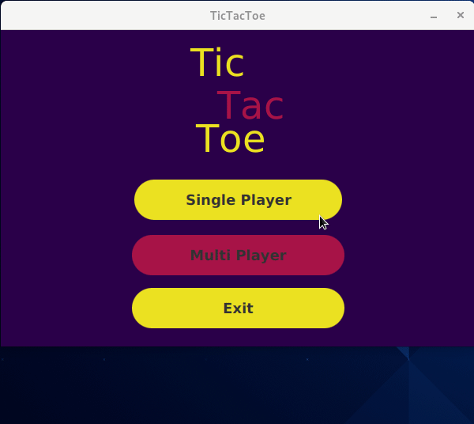
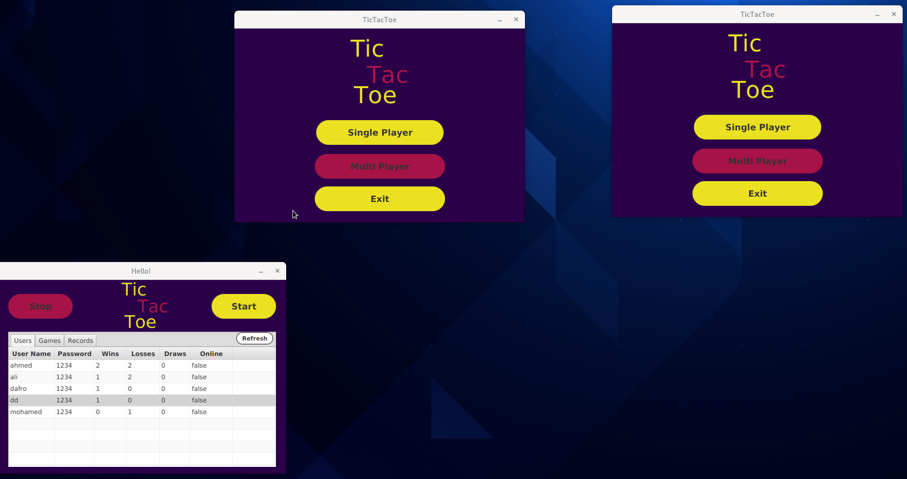

# TicTacToeClient

TicTacToe Client project

## Table of contents

- [Overview](#overview)
    - [GIF](#GIF)
- [My process](#my-process)
    - [Built with](#built-with)
- [Author](#authors)

## Overview

### GIF




<p align="right">(<a href="#top">back to top</a>)</p>

## My process

1) Clone the project

   ``` https://github.com/MohamedEldefrawy/TicTacToeClient.git ```

1. Clone project
2. Create local branch name **Development**
    1. command  ```git branch Development ```
3. Checkout to the Development branch
    1. command ```git checkout Development```
4. Lat step clone the Development branch to your local Development branch
    1. command ```git pull origin Development```

<p align="right">(<a href="#top">back to top</a>)</p>

### Built with

- Material design library **[JFoenix](http://www.jfoenix.com/)**
- Dependency manger **[Maven](https://maven.apache.org/)**
- MySql  **[MySql](https://dev.mysql.com/downloads/connector/j/)**
- Java Serialization/Deserialization library **[Gson](https://github.com/google/gson)**

<p align="right">(<a href="#top">back to top</a>)</p>

## Authors

* LinkedIn - [Mohamed Eldefrawy](https://www.linkedin.com/in/mohamedeldefrawy)
* LinkedIn - [Mohamed Emad](https://www.linkedin.com/in/mohamed-emad-528570b1)
* LinkedIn - [Mahitab Mohsen](https://www.linkedin.com/in/mahitab-mohsen-5446401bb/)
* LinkedIn - [Abdorrahman Ramadan](https://www.linkedin.com/in/abdorrahman-ramadan-696498161/)
*

<p align="right">(<a href="#top">back to top</a>)</p>